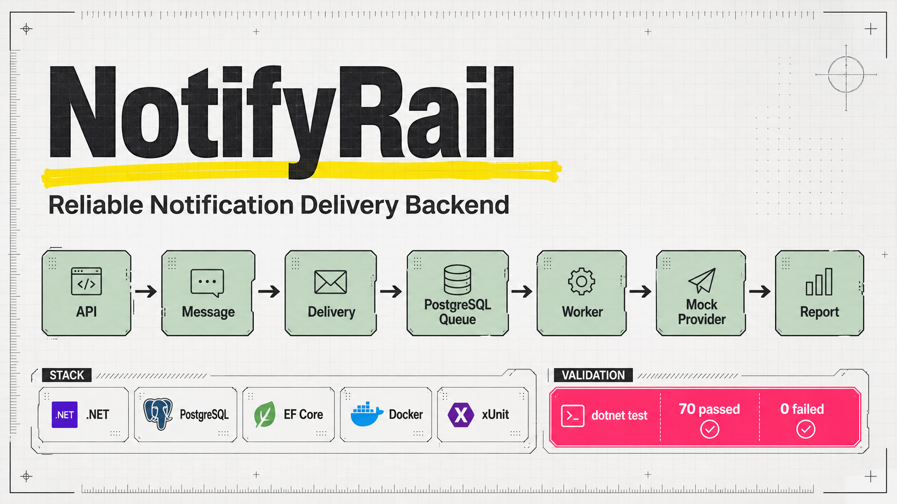
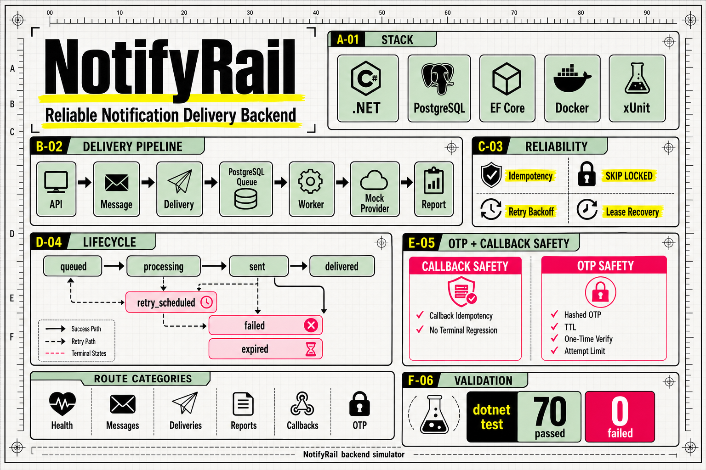

# NotifyRail .NET

NotifyRail is a backend-focused notification delivery simulator built with
C#/.NET, PostgreSQL, EF Core, Docker, and xUnit. It demonstrates the kind of
reliability problems real notification systems need to solve: idempotent intake,
per-recipient delivery jobs, PostgreSQL-backed queue claiming, retry/backoff,
provider callbacks, delivery reports, and OTP verification.



## Why This Exists

Notification platforms must accept message requests, avoid duplicate sends,
process deliveries asynchronously, handle provider failures, expose delivery
state, and verify short-lived OTP codes safely.

NotifyRail does not send real SMS messages. Instead, it implements the backend
control flow around a configurable mock provider so the delivery lifecycle can be
observed, tested, and explained without external provider accounts.

## Demo Flow

This demo runs against the real HTTP API and hosted worker. It creates a
three-recipient campaign, shows accepted, retryable, and permanent provider
outcomes, applies a provider callback, then sends and verifies an OTP.


Run the demo locally:

```sh
./scripts/run-demo-api.sh
./scripts/demo-flow.sh
```

The first command builds the API image, starts PostgreSQL, applies migrations,
and waits for the containerized API to become ready.

Regenerate the GIF after changing the script:

```sh
vhs scripts/demo-flow.tape
```

## What It Demonstrates

| Area | Implemented behavior |
| --- | --- |
| Message intake | `POST /messages` creates one message and one delivery per recipient in one transaction. |
| Idempotency | Global MVP idempotency keys support safe replay and conflict detection. |
| Queueing | PostgreSQL claims due deliveries with scheduling, priority ordering, expiry, and `FOR UPDATE SKIP LOCKED`. |
| Worker processing | A hosted background worker sends claimed deliveries through a mock provider. |
| Retry/backoff | Retryable provider failures schedule `next_attempt_at`; permanent failures stop immediately. |
| Attempt history | Every provider send attempt is persisted and exposed through the API. |
| Provider callbacks | Mock callbacks safely finalize `sent` deliveries without regressing terminal states. |
| OTP | OTP send is idempotent; verification is hashed, TTL-bound, one-time, and concurrency-safe. |
| Reporting | Message summary and report endpoints expose aggregate delivery status counts. |

## System Overview



The API and worker run in the same ASP.NET Core process for the MVP. PostgreSQL
is both the durable store and the delivery queue. The mock provider can be
configured per recipient, which makes accepted, retryable, and permanent failure
paths easy to demonstrate.

## Tech Stack

| Layer | Technology |
| --- | --- |
| Runtime | .NET 10 |
| Web | ASP.NET Core Minimal APIs |
| Persistence | PostgreSQL, EF Core, Npgsql |
| Queue | PostgreSQL row locking with `FOR UPDATE SKIP LOCKED` |
| Background work | ASP.NET Core hosted service |
| Tests | xUnit integration and unit tests |
| Local runtime | Docker Compose for the API, migration job, and PostgreSQL |

## Current API Surface

| Endpoint | Purpose |
| --- | --- |
| `GET /healthz` | Process liveness |
| `GET /readyz` | PostgreSQL readiness |
| `POST /messages` | Idempotent message and delivery creation |
| `GET /messages/{message_id}` | Message metadata and delivery status counts |
| `GET /messages/{message_id}/deliveries` | Recipient delivery states and attempt history |
| `GET /messages/{message_id}/report` | Aggregate delivery report |
| `POST /provider-callbacks/mock` | Mock provider final-status callback |
| `POST /otp/send` | Create an OTP challenge and recipient delivery |
| `POST /otp/verify` | Verify one OTP code before expiry and reject reuse |

The canonical HTTP contract is in
[docs/reference/http-api.md](docs/reference/http-api.md).

## Requirements

- Docker with Compose, for running the complete stack
- .NET SDK 10.0.x, only for host-based development and tests
- `jq`, for the demo script
- `vhs`, only if you want to regenerate `docs/assets/demo-flow.gif`

On Arch Linux:

```sh
sudo pacman -S --needed dotnet-sdk aspnet-runtime aspnet-targeting-pack docker jq vhs
```

## Run Locally

Build the API image, start PostgreSQL, apply migrations, and wait for the API:

```sh
docker compose up --detach --build --wait api
```

The API is available at `http://localhost:5012`. Check both health endpoints:

```sh
curl http://localhost:5012/healthz
curl http://localhost:5012/readyz
```

Follow the API logs:

```sh
docker compose logs --follow api
```

Stop the complete stack:

```sh
docker compose down
```

The `migrate` service uses the same application image, applies pending EF Core
migrations once, and exits. Compose starts the API only after PostgreSQL is
healthy and the migration service succeeds.

Create a message:

```sh
curl --request POST http://localhost:5012/messages \
  --header 'Content-Type: application/json' \
  --data '{
    "type": "transactional",
    "channel": "sms",
    "sender_title": "NotifyRail",
    "body": "Your order is ready.",
    "recipients": ["+905551111111", "+905552222222"],
    "idempotency_key": "order-42-ready"
  }'
```

A successful request returns `202 Accepted` with a `message_id`. The hosted
worker then claims due deliveries in the background and sends them through the
mock provider.

## OTP Example

Create a mock OTP challenge:

```sh
curl --request POST http://localhost:5012/otp/send \
  --header 'Content-Type: application/json' \
  --data '{
    "recipient": "+905551111111",
    "idempotency_key": "login-42"
  }'
```

Use the returned `otp_id` and `debug_code` once:

```sh
curl --request POST http://localhost:5012/otp/verify \
  --header 'Content-Type: application/json' \
  --data '{
    "otp_id": "<otp_id>",
    "code": "<debug_code>"
  }'
```

Repeating verification returns `409 Conflict`. `debug_code` exists only because
the MVP does not send real SMS messages; PostgreSQL stores only the code hash.

## Tests

Run the full suite in an isolated test container and ephemeral PostgreSQL
database:

```sh
./scripts/run-container-tests.sh
```

The script returns the test runner's exit code and removes the ephemeral test
containers when the suite finishes. Host-based `dotnet test NotifyRail.slnx`
remains available for development.

Current validation:

```text
Passed: 70
Failed: 0
Skipped: 0
```

The tests cover message idempotency, delivery queue claiming, priority ordering,
retry/backoff, stale claim recovery, provider callbacks, delivery reporting, OTP
TTL, OTP one-time verification, and concurrency-sensitive behavior.

## Development Notes

The API reads PostgreSQL from `ConnectionStrings:Postgres`. The development
configuration expects:

```text
Host=localhost;Port=5432;Database=notifyrail;Username=notifyrail;Password=notifyrail
```

For host-based development, start only PostgreSQL, apply migrations, and run
the API with the .NET SDK:

```sh
docker compose up -d --wait postgres
dotnet tool restore
dotnet ef database update --project src/NotifyRail.Api
dotnet run --project src/NotifyRail.Api
```

Useful commands:

```sh
docker compose up -d --wait postgres
dotnet restore
dotnet build NotifyRail.slnx
dotnet test NotifyRail.slnx
```

When changing EF models or persistence mappings:

```sh
dotnet ef migrations add <MigrationName> --project src/NotifyRail.Api
dotnet ef database update --project src/NotifyRail.Api
```

Stop all Compose services:

```sh
docker compose down
```

Delete local PostgreSQL data:

```sh
docker compose down -v
```

## Project Structure

| Path | Responsibility |
| --- | --- |
| `src/NotifyRail.Api/Program.cs` | Runtime wiring and endpoint registration |
| `src/NotifyRail.Api/Features/Health` | Liveness and readiness endpoints |
| `src/NotifyRail.Api/Features/Messages` | Message intake, summaries, delivery reads, and reports |
| `src/NotifyRail.Api/Features/Deliveries` | Delivery persistence, queue claiming, provider adapter, callbacks, and worker |
| `src/NotifyRail.Api/Features/Otp` | OTP send, hashing, challenge persistence, and verification |
| `src/NotifyRail.Api/Infrastructure/Persistence` | EF Core DbContext and migrations |
| `tests/NotifyRail.Api.Tests` | xUnit integration and unit tests |
| `docs/reference` | Canonical implemented contracts |
| `docs/adr` | Architecture decisions |
| `scripts` | Local demo and GIF generation scripts |

## Documentation

Start with [docs/README.md](docs/README.md).

- [PRD](docs/prd-notifyrail.md): target MVP goals, boundaries, user stories,
  and success criteria.
- [HTTP API reference](docs/reference/http-api.md): implemented routes,
  payloads, responses, validation, and idempotency behavior.
- [Delivery processing reference](docs/reference/delivery-processing.md):
  worker runtime, provider adapter contract, retry behavior, and queue claiming.
- [Delivery lifecycle reference](docs/reference/delivery-lifecycle.md):
  canonical states, transitions, invariants, and forbidden transitions.
- [Persistence model reference](docs/reference/persistence-model.md): tables,
  constraints, relationships, and indexes.
- [OTP verification reference](docs/reference/otp-verification.md): OTP
  challenge lifecycle, hashing, TTL, attempts, and verification rules.

## Status

The core MVP is implemented and test-covered. Planned future work belongs in the
PRD or issue tracker; stable implemented behavior belongs in `docs/reference/`.
